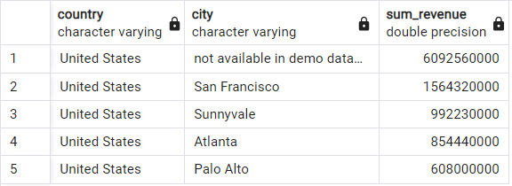

Answer the following questions and provide the SQL queries used to find the answer.

    
**Question 1: Which cities and countries have the highest level of transaction revenues on the site?**


SQL Queries:

```sql
SELECT
	country,
	city, 
	SUM(total_transaction_revenue) AS sum_revenue
FROM
	all_sessions
WHERE total_transaction_revenue IS NOT NULL
GROUP BY country, city
ORDER BY sum_revenue DESC
LIMIT 5
```

`
SELECT
	country,
	city, 
	SUM(total_transaction_revenue) AS sum_revenue
FROM
	all_sessions
WHERE total_transaction_revenue IS NOT NULL
GROUP BY country, city
ORDER BY sum_revenue DESC
LIMIT 5
`

SELECT
	country,
	city, 
	SUM(total_transaction_revenue) AS sum_revenue
FROM
	all_sessions
WHERE total_transaction_revenue IS NOT NULL
GROUP BY country, city
ORDER BY sum_revenue DESC
LIMIT 5


Answer:

| country | city | total_revenue |
|-|-|-|
| United States | not available in demo dataset | 6092560000 |
| United States | San Francisco | 1564320000 |
| United States | Sunnyvale | 992230000 |
| United States | Atlanta | 854440000 |
| United States | Palo Alto | 608000000 |




**Question 2: What is the average number of products ordered from visitors in each city and country?**


SQL Queries:


Answer:


**Question 3: Is there any pattern in the types (product categories) of products ordered from visitors in each city and country?**


SQL Queries:


Answer:


**Question 4: What is the top-selling product from each city/country? Can we find any pattern worthy of noting in the products sold?**


SQL Queries:


Answer:


**Question 5: Can we summarize the impact of revenue generated from each city/country?**

SQL Queries:


Answer:


